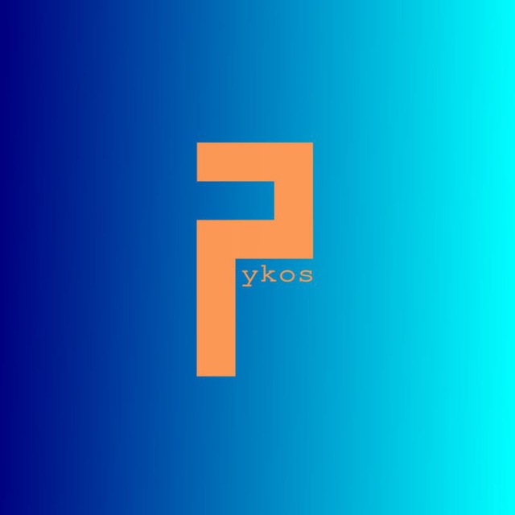

# Phykos
--------

## Who I am

Just a 15 y/o Ruby, ~~Kotlin, V~~ Lua, Crystal, Nim developer from [Mestre](https://en.wikipedia.org/wiki/Mestre), I am also learning Julia, ~~Haskell~~, ~~Elixir~~ and C.

GNU/Linux Manjaro ARM.

## Projects

Currently, I am working on [GCCRB](https://github.com/GCCRB), which is a wip [GCC](https://gcc.gnu.org/) frontend for the [Ruby programming language](https://www.ruby-lang.org/).

There is a lot of stuff to do, but some things, like monkey patching will not be there.

## Contacts

- [Telegram](t.me/rubydev)
- [Reddit](https://www.reddit.com/user/GPhykos/)
- [Gitlab](https://gitlab.com/phykos)
